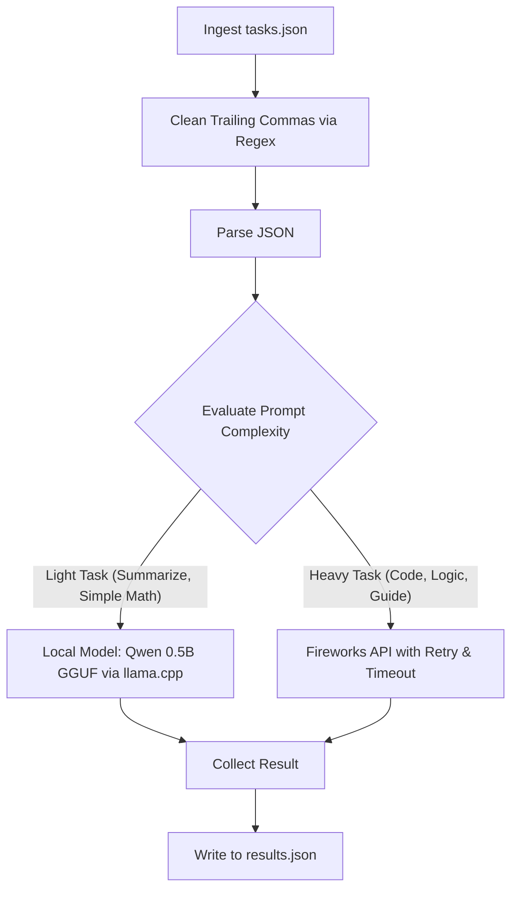

# Agent System Guide: AMD Hackathon Smart Router

This guide is designed for machine comprehension (LLM agents, orchestrators, and developers) to quickly understand the structure, execution flow, constraints, and features of this repository, specifically focused on [src/test_main.py](file:///d:/ai-dev/amd-hackathon-july/src/test_main.py).

---

## 1. System Role & Architecture Overview

The repository implements a **Smart Router** that processes natural language tasks across different complexity domains. The primary objective is to **minimize premium API token usage (cost)** while **maintaining baseline task accuracy**.



### Routing Strategy
- **Local zero-cost model (`model.gguf`)**: Handles simple tasks (e.g., short summarizations, basic arithmetic, elementary chat, sentiment classification).
- **Premium external API (Fireworks)**: Handles complex tasks (e.g., programming, advanced mathematics, logical riddles, multi-step instructions).

---

## 2. Directory Structure & Key Files

- [src/test_main.py](file:///d:/ai-dev/amd-hackathon-july/src/test_main.py): Upgraded main execution script containing the smart router logic, robust JSON loading, local model interface, and API retry loops.
- [src/main.py](file:///d:/ai-dev/amd-hackathon-july/src/main.py): Baseline router script that routes all tasks exclusively to the Fireworks API.
- [requirements.txt](file:///d:/ai-dev/amd-hackathon-july/requirements.txt): Declares dependencies including `llama-cpp-python`, `requests`, and `python-dotenv`.
- `model.gguf`: Quantized local model loaded by `test_main.py` (e.g. Qwen2.5-0.5B-Instruct-Q4_K_M).
- `.env`: Contains environment variables for local testing.

---

## 3. Operating Constraints (Docker Evaluation Environment)

When evaluated in the official harness, the code runs inside a highly restricted environment:
- **Hardware Limits**: 4 GB RAM, 2 vCPUs.
- **Time Limits**: Maximum runtime of 10 minutes; startup/initialization must complete in under 60 seconds.
- **Proxy Constraint**: All external calls to the Fireworks API must go through the provided proxy URL (`FIREWORKS_BASE_URL`).

---

## 4. Key Implementation Details in `test_main.py`

### A. Environment Setup & Fallbacks
- Loads variables from `.env` locally using `python-dotenv` if present, but transparently uses environment variables in the container.
- Resolves file system paths dynamically:
  - If running in Docker, paths resolve to `/input/tasks.json` and `/output/results.json`.
  - If running locally, they resolve to `./input/tasks.json` and `./output/results.json`.

### B. Robust JSON Parser (Trailing Comma Removal)
Standard python `json.load` raises a `JSONDecodeError` on trailing commas. To prevent failures from malformed input files, the script cleans the JSON string before parsing:
```python
import re
content_clean = re.sub(r',\s*([\]}])', r'\1', content)
tasks = json.loads(content_clean)
```

### C. Local Model Invocation
- Uses `llama-cpp-python` with `n_ctx=1024` and `verbose=False` to strictly limit memory utilization within the 4 GB RAM ceiling.
- Calls `llm.create_chat_completion(...)` to benefit from the GGUF model's embedded chat templates (e.g., ChatML), preventing syntax corruption.

### D. Advanced Task Routing Logic
A heuristic routing classifier evaluates prompts based on length and keyword profiles:
1. **Length Classifier**: Any prompt exceeding 800 characters automatically routes to Fireworks due to complexity and context size.
2. **Coding Keywords**: Routes prompts containing programming terms (`code`, `function`, `python`, `sql`, `regex`, `json`, etc.) to Fireworks.
3. **Advanced Math/Logic**: Routes prompts containing math/logic terms (`solve for`, `equation`, `derivative`, `integral`, `matrix`, `algebra`,
   `calculus`, `probability`, `statistics`, `puzzle`, `riddle`, etc.) to Fireworks.
4. **Complex Reasoning/Guides**: Routes instructions (`how to`, `step-by-step`, `detailed guide`, etc.) to Fireworks.
5. **Fallback**: Routes all other short prompts to the local zero-cost model.

### E. API Resilience & Retry Loops
To handle transient DNS, connection, or gateway failures (e.g., `NameResolutionError`), the script attempts up to 3 calls with exponential backoff and a 20-second timeout:
```python
max_attempts = 3
for attempt in range(1, max_attempts + 1):
    try:
        response = requests.post(url, headers=headers, json=payload, timeout=20)
        response.raise_for_status()
        return response.json()["choices"][0]["message"]["content"].strip()
    except Exception as e:
        if attempt == max_attempts:
            raise e
        time.sleep(attempt * 2)
```

---

## 5. Local Execution Verification

To verify functionality:
1. Make sure `.env` is populated with valid `FIREWORKS_API_KEY` and `FIREWORKS_BASE_URL`.
2. Execute the script from the repository root:
   ```bash
   python src/test_main.py
   ```
3. Check execution logs to verify proper routing and output formatting in `output/results.json`.
